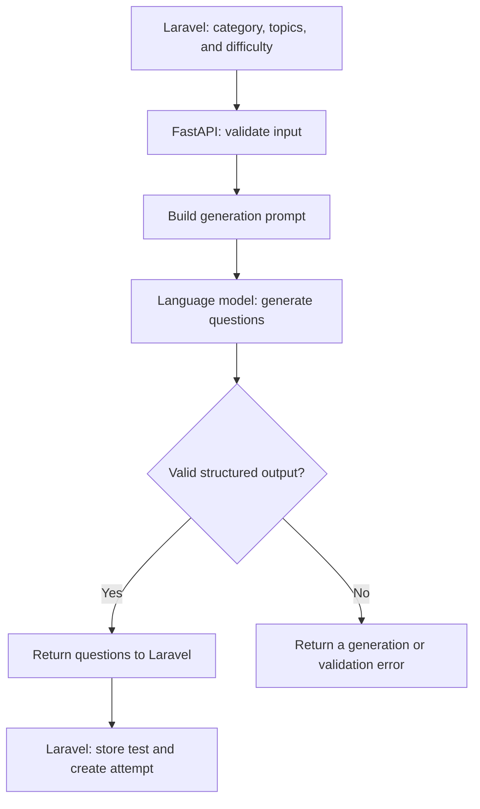

# Masar · AI Quiz Service

**AI-assisted placement-test generation for the Masar learning platform.**

This FastAPI service generates multiple-choice questions from course topics supplied by Masar's Laravel backend. It is the question-generation component of a larger workflow that includes test storage, scoring, and course recommendations.

> **Documentation status:** This draft is based on the Masar project report and the shared project description. The linked repository's source was not accessible during preparation. API contracts below reflect the report; confirm them, the application entry point, dependencies, and configuration against the current code before publishing this README.

## Overview

The learner selects a subject area in the Next.js interface. Laravel selects topics from the course catalog, assigns difficulty levels, and requests a placement test from this service. The service constructs a generation prompt, calls the language model, validates its output, and returns structured questions to Laravel.

In the documented workflow, a test contains **25 questions**, each with **four answer choices**, **one correct answer**, and **a short explanation**.

## Responsibilities

| Component | Responsibility |
| --- | --- |
| Next.js frontend | Display questions, collect answers, and display results. |
| Laravel backend | Select topics, authenticate users, store tests and attempts, score answers, and coordinate recommendations. |
| AI Quiz Service | Generate questions and validate the structure of the model response. |
| [HyDE Recommender Service](https://github.com/shahdzaa/recommender-service-HyDE) | Retrieve and rank courses from the existing catalog. |

The quiz service returns the answer key to the backend. Laravel stores it for server-side scoring and sends questions and choices to the learner without exposing the answer key.

## Request flow



## Technology

| Technology | Role |
| --- | --- |
| Python | Service implementation. |
| FastAPI | HTTP API. |
| Pydantic | Request validation. |
| Language-model provider | Generate questions from the supplied topics and instructions. |
| Uvicorn | ASGI server for local development. |

The current provider, model identifier, SDK, and supported Python version must be checked in the repository. They are intentionally not guessed here.

## Local setup

### 1. Clone the repository

```bash
git clone https://github.com/shahdzaa/ai-quiz-service.git
cd ai-quiz-service
python -m venv .venv
```

Activate the environment on macOS or Linux:

```bash
source .venv/bin/activate
```

Or in Windows PowerShell:

```powershell
.\.venv\Scripts\Activate.ps1
```

### 2. Install dependencies and configure the model

Use the dependency manifest included in the repository. If it is `requirements.txt`, run:

```bash
python -m pip install -r requirements.txt
```

Configure the language-model credentials and model selection using the exact settings read by the application. If an example environment file is provided, follow its names. Keep real credentials out of the repository and API examples.

### 3. Start the service

The Masar development architecture assigns this service port **8001**. Replace `YOUR_MODULE` below with the Python import path containing the FastAPI instance named `app`:

```bash
python -m uvicorn YOUR_MODULE:app --host 127.0.0.1 --port 8001 --reload
```

For example, use `main:app` only if the repository actually defines `app` in `main.py`. If it uses an application factory or a different instance name, adapt the command accordingly.

If the standard FastAPI documentation routes are enabled, inspect the running API at:

- [Swagger UI](http://127.0.0.1:8001/docs)
- [OpenAPI schema](http://127.0.0.1:8001/openapi.json)

## Documented API contract

### `POST /api/generate-quiz/`

The project report documents these request fields:

| Field | Meaning |
| --- | --- |
| `category` | The selected subject area. |
| `placement_topics` | The topics selected by Laravel, with their associated difficulty and context. |

The documented generation process uses 25 selected topics and asks the model to produce one question per topic while retaining topic order and difficulty.

The exact structure of a topic item, optional fields, JSON response keys, and error status codes must be taken from the current Pydantic models or OpenAPI schema. No speculative copy-and-paste request is included for an unverified schema.

### Expected question content

| Item | Documented meaning |
| --- | --- |
| Question text | A question about the assigned topic. |
| Answer choices | Four alternatives identified by A, B, C, and D. |
| Correct answer | One valid choice identifier. |
| Explanation | A short explanation of the answer. |
| Difficulty | The level assigned to the topic by the backend. |

Structural validation checks the question count, required fields, choices, answer identifiers, and difficulty values. It does not by itself establish the educational accuracy of a generated question.

## Integration with Masar

Laravel is the frontend's entry point. It calls this service internally, associates each generated question with its catalog topic, and saves the test and choices in a database transaction. After the learner submits answers, Laravel handles scoring and invokes the separate recommender service.

The report describes separate internal and frontend-facing endpoints. Do not confuse this service's `/api/generate-quiz/` endpoint with Laravel's `/api/placement/generate` route.

## Checks before finalizing this README

- Confirm the Python version, dependency manifest, and ASGI entry point.
- Document the actual model provider, model ID, and environment variable names.
- Verify the request and response schemas, validation rules, and status codes against the code.
- Add a tested request example after confirming the topic-item schema.
- Confirm whether the documented 25-question workflow is enforced by this version.

## Related project

- [Masar · HyDE Recommender Service](https://github.com/shahdzaa/recommender-service-HyDE)

